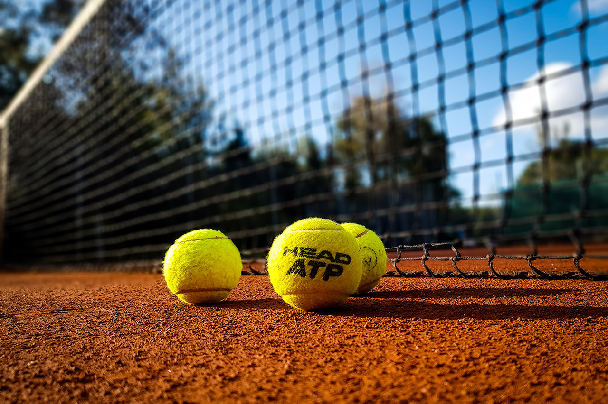
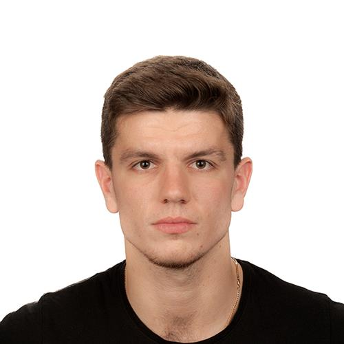

<!DOCTYPE html>
<html lang="pl">
<head>
<!--kodowanie znaków-->
    <meta charset="UTF-8">
<!--responsywaność-->
    <meta name=""viewport" content="width=device-width, initial-scale=1.0">
<!--import czcionki-->
    <link href="https://fonts.googleapis.com/css2?family=Lobster&display=swap" rel="stylesheet">
    <link rel="preconnect" href="https://fonts.gstatic.com">
    <link rel="icon" href="favicon.ico">
    <!--ikona-->
    <link rel="pilka icon" href="favicon.ico" type="image/x-icon">

    <title>Trener Tenisa</title>
    <link rel="stylesheet" href="style.css">
    <title>footer</title>
    <link rel="stylesheet" href="https://use.fontawesome.com/releases/v5.6.1/css/all.css" integrity="sha384-gfdkjb5BdAXd+lj+gudLWI+BXq4IuLW5IT+brZEZsLFm++aCMlF1V92rMkPaX4PP" crossorigin="anonymous">

</head>
<body>
    

        <header>
            
        </header>

        <nav>
            <a class="menu active" href="O_mnie.html" target="_blank">O mnie</a>
            <a class="menu" href="Atkualnosci.html" target="_blank">Aktualności</a>
            <a class="menu" href="Inspiracje.html" target="_blank">Inspiracje</a>
            <a class="menu" href="Kontakt.html" target="_blank">Kontakt</a>
        </nav>

        <section>
            <article>
                <h1>Trener Tenisa Ziemnego</h1>
                
 Wieloletnia kariera zawodnicza dała mi duże doświadzenie oraz wiedzę, którą od 2015 roku przekazuję zarówno dzieciom, jak i młodzieży Akademii Tenisowej Odra oraz szkole prywatnej "Nasza Szkoła" w Opolu.

                
Swoją przygodę z tenisem zaczęłem w wieku 12 lat w klubie tenisowym Pogoń Prudnik, początkowo pod okiem mojego taty, później trenera Wotolda Dzideczka. Zawodniczo trenowałam do 16 roku życia, a po drodze udało mi się zdobyć kilka tytułów na skalę polską oraz europejską. Na studiach grałem w sekcji tenisowej Politechniki Opolskiej, gdzie reprezentowałem moją uczelnie w turniejach akademickich.

                
Moje największe osiągnięcia:

                 Brązowy medal Halowych Mistrzostw Wielkopolski 2009 (gra podwójna)
                 Srebrny medal Mistrzostw Województwa Opolskiego 2011 (gra pojedyncza i podwójna)
                 Srebrny medal Halowych Mistrzostw Województwa Opolskiego 2012 (gra pojedyncza)
                 Brązowy medal Halowych Mistrzostw Opola 2012 (gra podwójna)
                 Srebrny medal Międzywojewódzkich Mistrzostw do lat 14 2012 (gra pojedyncza i podwójna)
                 III miejsce w turnieju Tennis Europe U16 w Oslo 2013 (gra podwójna)
                 III miejsce w turnieju Tennis Europe U16 na Cyprze 2014 (gra podwójna)
                 Brązowy medal Akademickich Drużynowych Mistrzostw Polski 2013
                

            </article>
            <iframe scrolling="no" frameborder="0" runat="server" width="560" height="315" src="https://www.youtube.com/embed/OVVg_BLg-Wo" frameborder="0" allow="accelerometer; autoplay; clipboard-write; encrypted-media; gyroscope; picture-in-picture" allowfullscreen></iframe>
            <!-- tutaj iframe-->
        </section>

        <footer>
            

                <h3>code opacity</h3>
                
Lorem ipsum dolar sit, amet consecture adipisicing elit.

                <ul class="socials">
                        <li><a href="#"><i class="fab fa-github"></i></a></li>
                        <li><a href="#"><i class="fab fa-facebook"></i></a></li>
                        <li><a href="#"><i class="fab fa-twitter"></i></a></li>
                        <li><a href="#"><i class="fab fa-youtube"></i></a></li>
                        <li><a href="#"><i class="fab fa-instagram"></i></a></li>
                        <li><a href="#"><i class="fab fa-google-plus"></i></a></li>
                </ul>
            

            

                    
Copyright &copy;2020 codeOpacity. Designed by BANAK

            

        </footer>

</body>
</html>
